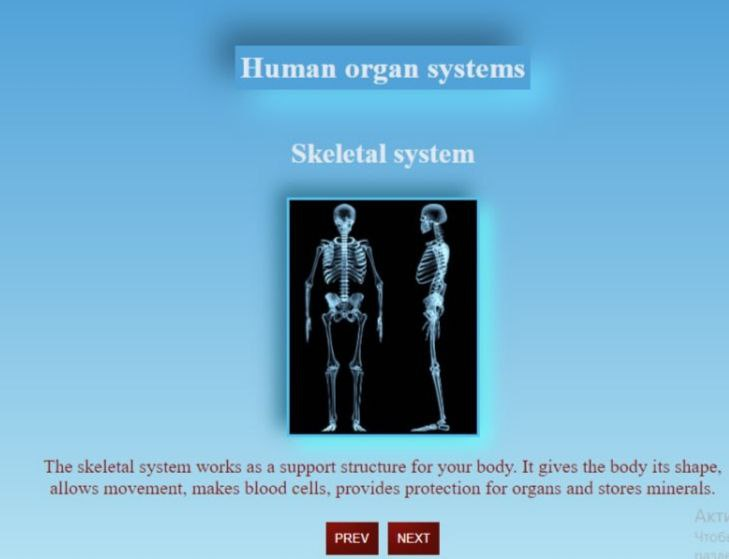

<!-- PROJECT LOGO -->

## Project Title

 <h3 align="center">My portfolio</h3>

  

 

### Built With

* HTML/CSS
* JavaScript
* React

<!-- ABOUT THE PROJECT -->

### About The Project

I created this project to show what a complex structure we have and how important it is to have an understanding of it in order to maintain our health at the proper level.

I used a functional component - the useState hook. I used the map() method, also used the filter() method, with its help I showed organ systems that you can still read about. And the subString() method to partially show the information.

Use the `BLANK_README.md` to get started.

<!-- GETTING STARTED -->
## Getting Started

This is an example of how you may give instructions on setting up your project locally.
To get a local copy up and running follow these simple example steps.

### Installation

_Below is an example of how you can instruct your audience on installing and setting up your app. This template doesn't rely on any external dependencies or services._

1. Clone the repo at [https://github.com/OksanaOxana/human-internal-organ-systems](https://github.com/OksanaOxana/human-internal-organ-systems)
2. In the terminal you need to paste the copied link to the project
3. Next, enter the cloned folder and open the code

<!-- CONTACT -->
## Contact

If you have any comments on my project, here are my contacts:

[Whatsapp](https://wa.me/+375299779119)

[Telegram](https://t.me/OxanaAksana)

[oxi_butylova@mail.ru](https://oxi_butylova@mail.ru)

Project Link: [https://github.com/OksanaOxana/human-internal-organ-systems](https://github.com/OksanaOxana/human-internal-organ-systems)
